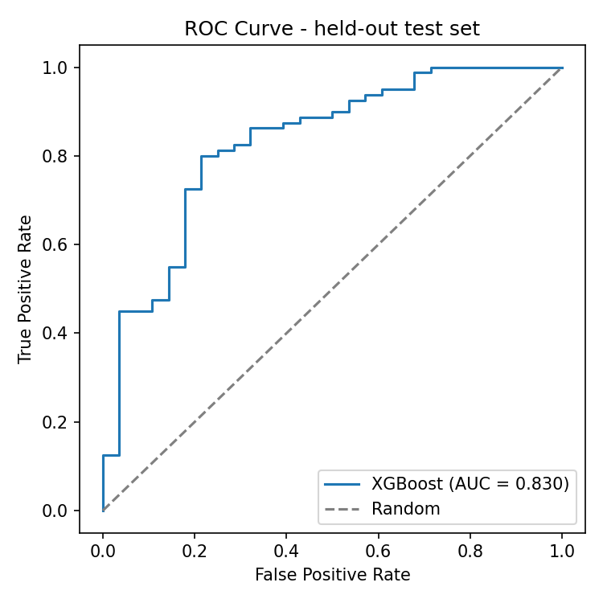
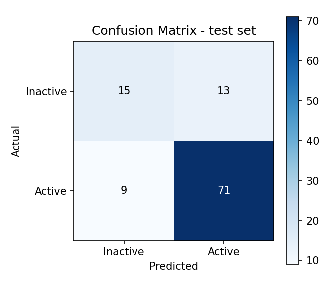
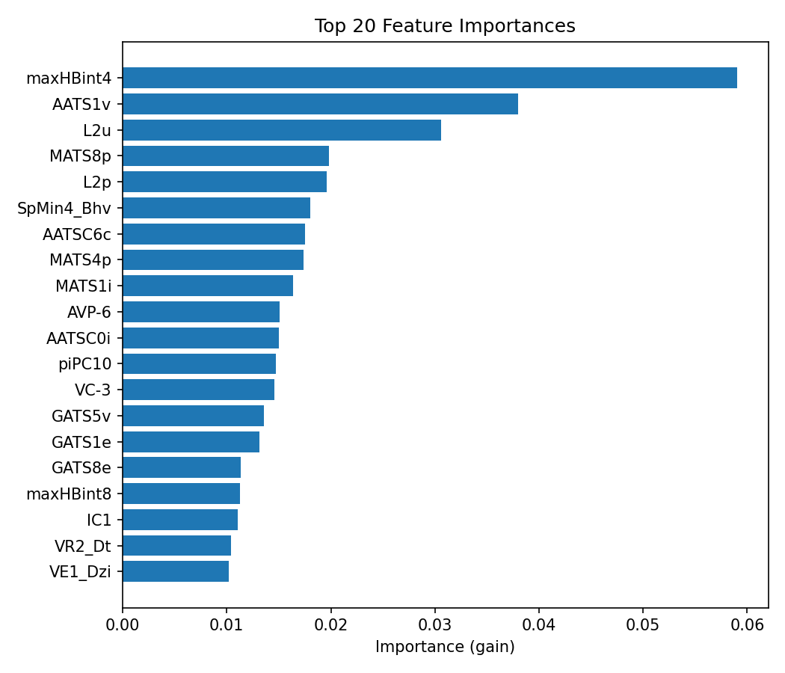

# JAK1 Inhibitor Screening with XGBoost

Machine-learning screening of small molecules for **JAK1-inhibitory activity** from their molecular
descriptors. JAK1 is a kinase central to cytokine signaling; its dysregulation is linked to
autoimmune disease and cancer, making JAK1 inhibitors an important therapeutic class. This project
trains a gradient-boosted classifier to flag likely-active compounds, narrowing a large library down
to a short list worth testing in the lab.

> Originally a university course project, refactored into a reproducible, leakage-free pipeline.
> The most interesting part of the rewrite was **finding and fixing a data-leakage bug** that had
> been inflating the reported test AUC to ~1.0 (see [Methodology](#methodology--the-leakage-fix)).

## Results

The headline metric is **stratified 5-fold cross-validation** — a fresh model is trained on each
fold's training split and scored only on its held-out fold, so no compound is ever scored by a model
that trained on it.

| Metric    | 5-fold CV (mean ± std) | Held-out test |
|-----------|:----------------------:|:-------------:|
| AUC       | **0.856 ± 0.030**      | 0.826         |
| F1        | 0.891 ± 0.013          | 0.866         |
| Precision | 0.856 ± 0.015          | 0.845         |
| Recall    | 0.930 ± 0.018          | 0.888         |
| Accuracy  | 0.833 ± 0.019          | 0.796         |

For context, an "always predict active" baseline scores AUC 0.50 and accuracy ≈ 0.73 (the positive
class is ~73% of the data), so the model adds real signal beyond the class prior.

| ROC curve | Confusion matrix | Top features |
|---|---|---|
|  |  |  |

## Repository structure

```
.
├── data/
│   ├── AID_1919099_datatable_all.csv      # raw PubChem BioAssay export (SMILES + activity)
│   └── drug_descriptors_normalized.csv    # normalized molecular descriptors + `Active` label
├── src/
│   ├── build_descriptors.py                # raw export -> PaDEL descriptors -> MaxAbs-normalized CSV
│   └── xgb_pipeline.py                     # single config-driven pipeline (train / CV / eval / plots)
├── notebooks/
│   └── exploratory_xgb.ipynb               # EDA: class balance, descriptor variance, correlations
├── models/
│   └── best_model_xgb.pkl                  # model saved by `--train` (known provenance)
├── results/
│   ├── grid_search_results.csv
│   ├── roc_curve.png
│   ├── confusion_matrix.png
│   └── feature_importance.png
├── requirements.txt
└── README.md
```

## Data

- **Source:** PubChem BioAssay [AID 1919099](https://pubchem.ncbi.nlm.nih.gov/bioassay/1919099)
  (JAK1 activity), exported to `data/AID_1919099_datatable_all.csv`.
- **Features:** ~1,875 molecular descriptors computed from each compound's SMILES and normalized,
  stored in `data/drug_descriptors_normalized.csv`.
- **Samples:** 719 compounds. **Labels:** `Active = 528`, `Inactive = 191` (≈73% positive — imbalanced).
- **Task:** binary classification, `Active ∈ {0, 1}`.

This is a wide, small dataset (more features than samples), so feature selection and regularization
matter, and cross-validation is preferred over a single split for a stable performance estimate.

**How the descriptor file was built** (`src/build_descriptors.py`): the raw export is cleaned and
labelled (`Active` → 1, `Unspecified` → 0), PaDEL-Descriptor computes the 1875 2D+3D descriptors from
each SMILES, and every column is scaled by its maximum absolute value (scikit-learn `MaxAbsScaler`,
so values land in [-1, 1] with zeros preserved). The descriptor step needs Java + `padelpy`; PaDEL's
3D descriptors depend on its conformer settings, so re-running reproduces the methodology and
near-identical values rather than a byte-for-byte copy. The labelling and normalization steps are
exact and verifiable: `python src/build_descriptors.py --check` runs them with no Java required.

## Methodology & the leakage fix

1. **Feature selection** (optional, `--feature-selection`): drop near-constant descriptors with
   `VarianceThreshold`, then keep those with `|correlation| > 0.1` against the target.
2. **Model:** `XGBClassifier` (`binary:logistic`), tuned over a small grid
   (`max_depth`, `learning_rate`, `n_estimators`, `subsample`, `colsample_bytree`).
3. **Evaluation:** stratified 5-fold cross-validation by default; a single train/val/test split is
   available via `--holdout` / `--train`.

**The bug.** The original notebooks loaded a pre-trained model and then evaluated it on splits drawn
from the *entire* dataset. Because the loaded model had already trained on many of those rows, the
"test" set was contaminated and Test AUC came out at ~0.997 — a too-good-to-be-true number that
would not survive interview scrutiny.

**The fix.** The default path no longer trusts a model of unknown split provenance. It runs stratified
k-fold CV, training a fresh model per fold and scoring only the held-out fold. The honest estimate is
**AUC ≈ 0.86**, not 1.0.

| Approach | Test AUC | Honest? |
|----------|:--------:|:-------:|
| Original: load a pre-trained model of unknown provenance, score on the full dataset | ~0.997 | ❌ leaked |
| This repo, single split (`--train` / `--holdout` / `--load-model`) — test never trained on | ~0.83 | ✅ |
| This repo, default 5-fold CV (recommended) | 0.86 | ✅ |

The shipped `models/best_model_xgb.pkl` is produced by `--train` on the same split the evaluation
uses, so `--load-model` is clean here too. It still prints a caution, because loading an *externally*
supplied model whose split is unknown is exactly what caused the original leak.

## Reproduce

```bash
pip install -r requirements.txt
# macOS only, if XGBoost reports a missing libomp: brew install libomp

python src/xgb_pipeline.py                 # 5-fold cross-validation (headline metric)
python src/xgb_pipeline.py --train         # grid search -> save model -> held-out test report
python src/xgb_pipeline.py --plots         # regenerate the figures in results/
python src/xgb_pipeline.py --feature-selection   # add to any mode to filter features first
```

To rebuild the descriptor dataset from the raw PubChem export (needs Java + `padelpy`):

```bash
pip install padelpy            # plus a Java runtime, e.g. `brew install openjdk`
python src/build_descriptors.py           # raw -> PaDEL descriptors -> normalized CSV
python src/build_descriptors.py --check    # validate labelling + normalization (no Java needed)
```

Paths, random seeds, and the hyper-parameter grid are all in the config block at the top of
`src/xgb_pipeline.py`.

## Limitations & next steps

- **Small, imbalanced dataset** (719 rows). CV reduces variance in the estimate but more data would
  help; class weighting or resampling could improve recall on the minority `Inactive` class.
- **In-sample overfitting:** training metrics hit 1.0, so there is headroom for stronger
  regularization (`reg_lambda`, lower `max_depth`, early stopping on a validation fold).
- **No scaffold-aware splitting:** random splits can place near-identical analogs in both train and
  test. A scaffold/cluster split would give a stricter, more realistic generalization estimate.
- **Exact descriptor reproduction:** `src/build_descriptors.py` scripts the full raw → normalized
  pipeline, but PaDEL's 3D descriptors depend on conformer-generation settings that weren't recorded,
  so a rerun reproduces the methodology rather than a byte-identical file. Pinning the PaDEL version
  and settings would close this gap.

## Context

Final project for *Introduction to Artificial Intelligence* (NTU COOL course 41429), by
Yu-Hsiang Cheng (Taipei Medical University). This repository is a refactor of that coursework into a
standalone, reproducible project.
